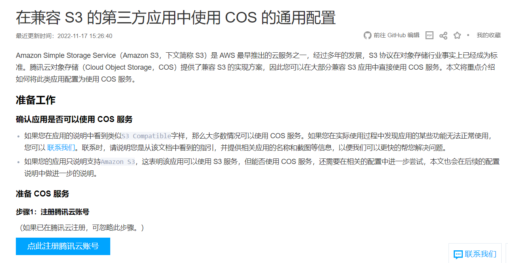
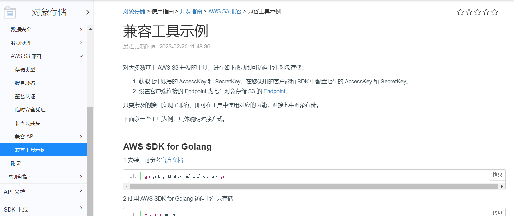
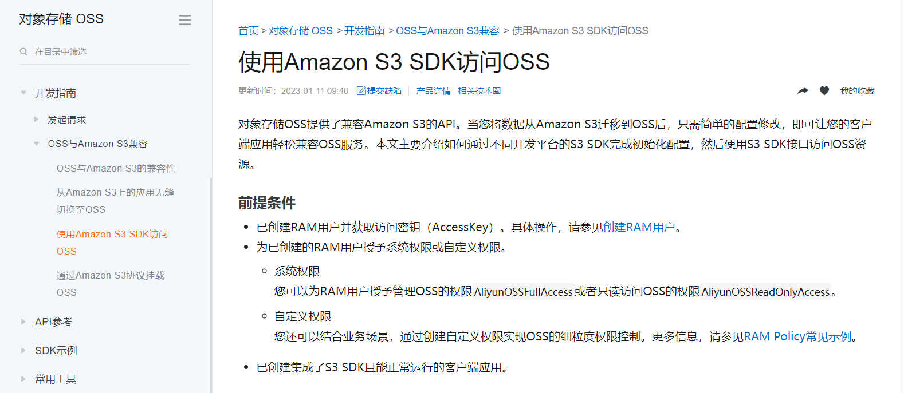

# 企业级OSS SDK

1.企业级OSS对象存储服务Spring Boot Starter制作，开箱即用，为项目进行赋能。基于AmazonS3协议，适配市面上的对象存储服务如：阿里云
OSS、 腾讯COS、七牛云OSS、MInio等等。

2.使用OSS对象存储服务，主要是对图片、文件、音频等对象集中式管理权限控制，管理数据生命周期等等，提供上传，下载，预览，删除等功能。

3.本SDK是基于AmazonS3实现我们自己的Spring Boot Starter，为啥自己实现呢？原因：市面上OSS对象存储服务基本都支持AmazonS3，我们封
装我们的自己的starter那么就必须考虑适配，迁移，可扩展。比喻说我们今天使用的是阿里云OSS对接阿里云OSS的SDK，后天我们使用的是 腾讯
COS对接是腾讯云COS，我们何不直接对接AmazonS3实现呢，这样后续不需要调整代码，只需要去各个云服务商配置就好了。

4.本SDK兼容性：

  4.1)腾讯云官方说明:https://cloud.tencent.com/document/product/436/41284

  4.2 七牛云官方说明：https://developer.qiniu.com/kodo/4096/s3-compatible-sdk

  4.3 阿里云官方说明：https://help.aliyun.com/document_detail/451966.html

  4.4 Minio官方说明：https://min.io/docs/minio/container/index.html

  
  
5. Spring-boot集成本SDK：

   5.1) 引入pom.xml
   

       <dependency>
           <groupId>com.ljm</groupId>
           <artifactId>oss-spring-boot-starter</artifactId>
           <version>${oss.version}</version>
       </dependency>
   
  5.2) yaml配置

        oss:
        #  Minio
        #  endpoint: xxx
        #  accessKey: xxx
        #  secretKey: xxx
        #  bucketName: oss

        #  阿里云OSS
        #  endpoint: oss-cn-beijing.aliyuncs.com
        #  accessKey: xxx
        #  secretKey: xxx
        #  bucketName: oss
        #  region: oss-cn-beijing

        # 七牛云OSS(AWS S3的endpoint域名)
        #  endpoint: s3-cn-south-1.qiniucs.com
        #  accessKey: xxx
        #  secretKey: xxx
        #  bucketName: oss
        #  region: z2

  5.3) 单元测试

        @SpringBootTest
        class OssSpringStarterTest {
        @Autowired
        private OssTemplate ossTemplate;
        
            @Test
            void test() {
                //创建桶
                //ossTemplate.createBucket("oss");

                List<Bucket> list =  ossTemplate.getAllBuckets();
                for (Bucket bu:list) {
                    System.out.println(bu.getName());
                }
            }
        }

